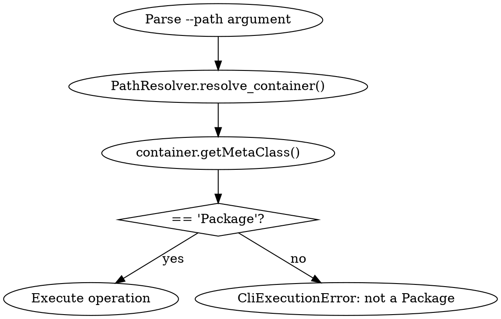
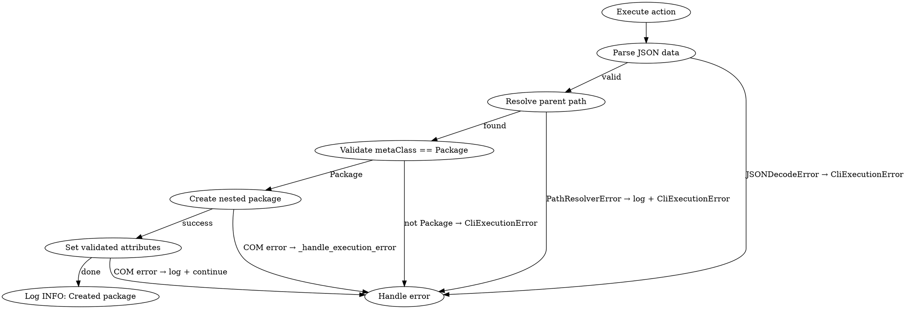

# Package Command Design

**Status:** Approved
**Date:** 2026-07-09
**Author:** Design brainstorming session

## Overview

Add a `package` command group specialized for package operations with bulk creation support, validated attributes, multi-level path navigation, and package-only path validation.

## Requirements

### Core Requirements

1. **Package-specific command** - Separate from generic `element` command
2. **Multi-level path support** - Navigate package hierarchies with `/` or `\` separators
3. **Package-only validation** - Path must resolve to Package element before operations
4. **Bulk creation** - Support single hash or array of hashes to create multiple packages
5. **Validated attributes** - Whitelist of supported attributes, skip unknown with warning
6. **Proper logging** - INFO for success, WARNING for skipped attributes, ERROR for failures
7. **Error handling** - Follow existing patterns with CliExecutionError and proper logging

## Architecture

### Command Structure

```
package (command group)
├─ create  - Create one or multiple packages with attributes
├─ delete  - Delete a package
├─ view    - View package details
└─ items   - List all children items in a package
```

### Files to Create

1. **src/rhapsody_cli/commands/package_command.py**
   - `PackageCommand` class - dispatcher for package subcommands
   - Follows `ElementCommand` pattern
   - Registers 4 actions: PackageCreateAction, PackageDeleteAction, PackageViewAction, PackageItemsAction

2. **src/rhapsody_cli/actions/package_action.py**
   - `PackageCreateAction` - handles `package create`
   - `PackageDeleteAction` - handles `package delete`
   - `PackageViewAction` - handles `package view`
   - `PackageItemsAction` - handles `package items`

3. **Register in src/rhapsody_cli/cli/main.py**
   - Add `package` command to CLI dispatcher

### Integration Points

- **PathResolver** - Multi-level path navigation (already exists)
- **OutputFormatter** - Table/JSON/CSV output formatting (already exists)
- **ElementManagementAction** - Base class with logging and error handling (already exists)
- **RPPackage wrapper** - addNestedPackage(), getNestedPackages(), etc. (already exists)

## Subcommands

### 1. package create

**Purpose:** Create one or multiple packages with validated attributes.

**Arguments:**
- `--path <parent-path>` - Parent package path (required, must be Package)
- `attributes` - JSON hash or array (positional argument, required)

**Examples:**
```bash
# Single package
package create --path Sensors '{"name":"TempSensors","description":"Temperature sensors"}'

# Multiple packages (bulk)
package create --path Sensors '[{"name":"TempSensors","description":"Temperature"},{"name":"PressureSensors","description":"Pressure"}]'

# With properties
package create --path Main '{"name":"Subsystem","description":"Main subsystem","properties":{"visibility":"public"}}'
```

**Implementation:**
```python
class PackageCreateAction(ElementManagementAction):
    def init_arguments(self, sub_parser):
        parser = sub_parser.add_parser("create", help="Create a package")
        parser.add_argument("--path", required=True, help="Parent package path")
        parser.add_argument("attributes", help="JSON hash or array with package attributes (name required)")
        self.add_verbose_argument(parser)

    def execute(self, args):
        # Parse JSON
        try:
            data = json.loads(args.attributes)
        except json.JSONDecodeError as e:
            raise CliExecutionError(f"Invalid JSON: {e}")

        packages_data = data if isinstance(data, list) else [data]

        # Resolve and validate parent package FIRST
        try:
            project = self._get_active_project()
            root = project.getRoot()
            container = PathResolver.resolve_container(root, args.path)

            # VALIDATE: Must be Package
            meta_class = container.getMetaClass()
            if meta_class != "Package":
                raise CliExecutionError(
                    f"Path '{args.path}' does not resolve to a Package (found {meta_class})"
                )
        except PathResolverError as e:
            self.logger.error("Path resolution failed: %s", e)
            raise CliExecutionError(str(e)) from e
        except Exception as e:
            self._handle_execution_error(e, f"Failed to resolve path '{args.path}'")

        # Create packages
        created = []
        errors = []
        for pkg_attrs in packages_data:
            try:
                name = pkg_attrs.get("name")
                if not name:
                    raise CliExecutionError("'name' is required in attributes")

                # Filter unknown attributes
                unknown = set(pkg_attrs.keys()) - self.VALID_ATTRIBUTES
                if unknown:
                    self.logger.warning("Skipping unknown attributes: %s", unknown)

                # Create package
                package = container.addNestedPackage(name)

                # Set validated attributes
                self._set_attributes(package, pkg_attrs)

                full_path = f"{args.path}/{name}"
                self.logger.info("Created package: %s", full_path)
                created.append(name)

            except Exception as e:
                self.logger.error("Failed to create package '%s': %s", pkg_attrs.get("name", "unknown"), e)
                errors.append((pkg_attrs.get("name", "unknown"), str(e)))

        # Report results
        if errors and not created:
            raise CliExecutionError(f"Created 0/{len(packages_data)} packages; all failed")
        elif errors:
            self.logger.info("Created %d/%d packages with %d error(s)", len(created), len(packages_data), len(errors))
```

### 2. package delete

**Purpose:** Delete a package at specified path.

**Arguments:**
- `--path <package-path>` - Package path to delete (required, must be Package)

**Example:**
```bash
package delete --path Sensors/OldPackage
```

**Implementation:**
```python
class PackageDeleteAction(ElementManagementAction):
    def init_arguments(self, sub_parser):
        parser = sub_parser.add_parser("delete", help="Delete a package")
        parser.add_argument("--path", required=True, help="Package path to delete")
        self.add_verbose_argument(parser)

    def execute(self, args):
        try:
            project = self._get_active_project()
            root = project.getRoot()
            package = PathResolver.resolve_container(root, args.path)

            # VALIDATE: Must be Package
            meta_class = package.getMetaClass()
            if meta_class != "Package":
                raise CliExecutionError(
                    f"Path '{args.path}' does not resolve to a Package (found {meta_class})"
                )

            # Delete package
            package.deleteFromProject()
            self.logger.info("Deleted package: %s", args.path)

        except PathResolverError as e:
            self.logger.error("Path resolution failed: %s", e)
            raise CliExecutionError(str(e)) from e
        except Exception as e:
            self._handle_execution_error(e, f"Failed to delete package '{args.path}'")
```

### 3. package view

**Purpose:** View package details (name, GUID, description, etc.).

**Arguments:**
- `--path <package-path>` - Package path to view (required, must be Package)

**Example:**
```bash
package view --path Sensors
package view --path Sensors/TemperatureSensors --output json
```

**Output:**
Table/JSON/CSV via global `--output` flag.

**Implementation:**
```python
class PackageViewAction(ElementManagementAction):
    def init_arguments(self, sub_parser):
        parser = sub_parser.add_parser("view", help="View package details")
        parser.add_argument("--path", required=True, help="Package path to view")
        self.add_verbose_argument(parser)

    def execute(self, args):
        try:
            project = self._get_active_project()
            root = project.getRoot()
            package = PathResolver.resolve_container(root, args.path)

            # VALIDATE: Must be Package
            meta_class = package.getMetaClass()
            if meta_class != "Package":
                raise CliExecutionError(
                    f"Path '{args.path}' does not resolve to a Package (found {meta_class})"
                )

            # Get package details
            details = {
                "Name": package.getName(),
                "GUID": package.getGUID(),
                "Description": package.getDescription(),
                "MetaClass": package.getMetaClass(),
                "FullPath": package.getFullPathName(),
            }

            # Format output
            output = OutputFormatter.table(["Property", "Value"], [[k, v] for k, v in details.items()])
            print(output)

        except PathResolverError as e:
            self.logger.error("Path resolution failed: %s", e)
            raise CliExecutionError(str(e)) from e
        except Exception as e:
            self._handle_execution_error(e, f"Failed to view package '{args.path}'")
```

### 4. package items

**Purpose:** List all children items in a package.

**Arguments:**
- `--path <package-path>` - Package path (required, must be Package)

**Example:**
```bash
package items --path Sensors
```

**Output:**
Table showing type and name for each child element (nested packages, classes, actors, use cases, enumerations, etc.).

**Implementation:**
```python
class PackageItemsAction(ElementManagementAction):
    def init_arguments(self, sub_parser):
        parser = sub_parser.add_parser("items", help="List children items in a package")
        parser.add_argument("--path", required=True, help="Package path")
        self.add_verbose_argument(parser)

    def execute(self, args):
        try:
            project = self._get_active_project()
            root = project.getRoot()
            package = PathResolver.resolve_container(root, args.path)

            # VALIDATE: Must be Package
            meta_class = package.getMetaClass()
            if meta_class != "Package":
                raise CliExecutionError(
                    f"Path '{args.path}' does not resolve to a Package (found {meta_class})"
                )

            # Get all children items
            items = []
            for nested_pkg in package.getNestedPackages():
                items.append(["Package", nested_pkg.getName()])
            for cls in package.getClasses():
                items.append(["Class", cls.getName()])
            for actor in package.getActors():
                items.append(["Actor", actor.getName()])
            for usecase in package.getUseCases():
                items.append(["UseCase", usecase.getName()])
            for enum in package.getEnumerations():
                items.append(["Enumeration", enum.getName()])

            # Format output
            output = OutputFormatter.table(["Type", "Name"], items)
            print(output)

        except PathResolverError as e:
            self.logger.error("Path resolution failed: %s", e)
            raise CliExecutionError(str(e)) from e
        except Exception as e:
            self._handle_execution_error(e, f"Failed to list items in package '{args.path}'")
```

## Validated Attribute Whitelist

**Supported attributes for package creation:**

| Attribute | Method | Description |
|-----------|--------|-------------|
| `name` | `setName()` | Required - package name |
| `description` | `setDescription()` | Plain text description |
| `description_html` | `setDescriptionHTML()` | HTML description |
| `description_rtf` | `setDescriptionRTF()` | RTF description |
| `display_name` | `setDisplayName()` | Display name |
| `display_name_rtf` | `setDisplayNameRTF()` | RTF display name |
| `properties` | `setPropertyValue()` | Dict of custom properties |

**Whitelist constant:**
```python
VALID_ATTRIBUTES = {
    "name", "description", "description_html", "description_rtf",
    "display_name", "display_name_rtf", "properties"
}
```

**Validation behavior:**
- Required: `name` attribute (validated first)
- Optional: All other whitelist attributes
- Unknown attributes: Logged as warning, silently skipped
- Type validation: JSON must be hash or array

**Attribute setter implementation:**
```python
def _set_attributes(self, package, attrs):
    """Set validated attributes on package."""
    if "description" in attrs:
        package.setDescription(attrs["description"])
    if "description_html" in attrs:
        package.setDescriptionHTML(attrs["description_html"])
    if "description_rtf" in attrs:
        package.setDescriptionRTF(attrs["description_rtf"])
    if "display_name" in attrs:
        package.setDisplayName(attrs["display_name"])
    if "display_name_rtf" in attrs:
        package.setDisplayNameRTF(attrs["display_name_rtf"])
    if "properties" in attrs:
        for key, val in attrs["properties"].items():
            package.setPropertyValue(key, val)
```

## Path Validation

### Multi-level Path Support

- Path separator: `/` or `\` (handled by existing `PathResolver`)
- Examples: `Sensors`, `Sensors/TemperatureSensors`, `Main/Subsystem/Components`
- Implementation: Use `PathResolver.resolve_container(root, path)` from existing infrastructure

### Package-only Validation

**Validation flow:**


**Validation code:**
```python
container = PathResolver.resolve_container(root, args.path)
meta_class = container.getMetaClass()
if meta_class != "Package":
    raise CliExecutionError(
        f"Path '{args.path}' does not resolve to a Package (found {meta_class})"
    )
```

### Error Messages

- **Invalid path**: `"Path 'Sensors/Invalid' not found"` (from PathResolverError)
- **Not a Package**: `"Path 'Sensors/MyClass' does not resolve to a Package (found Class)"`
- **Missing name**: `"'name' is required in attributes"`
- **Unknown attributes**: `"Skipping unknown attributes: invalid_attr, another_unknown"` (warning log)

## Logging and Error Handling

### Logger Integration

Follow existing `ElementManagementAction` patterns:

- Use `self.logger` (inherited from base class)
- Log levels: INFO for success, WARNING for skipped attributes, ERROR for failures
- Format: `self.logger.info("Created package: %s/%s", args.path, name)`

### Error Handling Patterns

**From existing actions:**

1. **CliExecutionError** - Validation failures and user errors
2. **_handle_execution_error(e, message)** - COM operation failures
3. **_handle_connection_error(e, message)** - Rhapsody connection errors
4. **PathResolverError** - Path resolution failures

**Implementation:**
```python
try:
    # Operation
except PathResolverError as e:
    self.logger.error("Path resolution failed: %s", e)
    raise CliExecutionError(str(e)) from e
except Exception as e:
    self._handle_execution_error(e, "Failed to ...")
```

### Error Handling Flow



## Testing

### Unit Tests

**File:** `tests/unit/actions/test_package_action.py`

**Test coverage:**
- Mocked COM objects (no Rhapsody installation required)
- Each subcommand tested independently
- Path validation tests (valid Package, invalid element type)
- Attribute validation tests (valid attributes, unknown attributes skipped)
- Bulk creation tests (single hash, array of hashes)
- Error handling tests (invalid JSON, path not found, not Package)

**Test structure:**
```python
class TestPackageCreateAction:
    def test_create_single_package(self, mock_project):
        # Test single package creation

    def test_create_bulk_packages(self, mock_project):
        # Test array of packages

    def test_create_with_attributes(self, mock_project):
        # Test attribute setting

    def test_create_unknown_attributes_skipped(self, mock_project):
        # Test warning log for unknown attributes

    def test_create_path_not_package(self, mock_project):
        # Test error when path resolves to Class

    def test_create_missing_name(self, mock_project):
        # Test error when name not in attributes

    def test_create_invalid_json(self, mock_project):
        # Test JSON parse error

class TestPackageDeleteAction:
    def test_delete_package(self, mock_project):
        # Test deletion

    def test_delete_path_not_package(self, mock_project):
        # Test error when not Package

class TestPackageViewAction:
    def test_view_package(self, mock_project):
        # Test viewing details

    def test_view_output_formats(self, mock_project):
        # Test table/JSON/CSV output

class TestPackageItemsAction:
    def test_list_items(self, mock_project):
        # Test listing children

    def test_list_empty_package(self, mock_project):
        # Test empty package
```

### Integration Tests

**File:** `tests/integration/test_package_command.py`

**Test coverage:**
- Real Rhapsody COM automation (requires running Rhapsody)
- Multi-level path navigation
- Package creation with real attributes
- Package deletion and cleanup

## Implementation Checklist

### Phase 1: Core Infrastructure
- [ ] Create `package_command.py` with PackageCommand dispatcher
- [ ] Create `package_action.py` with 4 Action classes
- [ ] Register `package` command in `main.py`

### Phase 2: Implementation
- [ ] Implement PackageCreateAction with bulk support and validation
- [ ] Implement PackageDeleteAction with path validation
- [ ] Implement PackageViewAction with output formatting
- [ ] Implement PackageItemsAction with children listing

### Phase 3: Testing
- [ ] Write unit tests for all 4 actions
- [ ] Test path validation (Package vs non-Package)
- [ ] Test attribute validation (whitelist vs unknown)
- [ ] Test bulk creation (single vs array)
- [ ] Test error handling

### Phase 4: Integration
- [ ] Integration tests with real Rhapsody
- [ ] Manual CLI testing
- [ ] Update README.md with package command usage

## Success Criteria

1. **All subcommands working** - create, delete, view, items
2. **Multi-level path navigation** - works with `/` and `\` separators
3. **Package-only validation** - errors if path not Package
4. **Bulk creation** - single hash and array supported
5. **Validated attributes** - unknown attributes skipped with warning
6. **Proper logging** - INFO, WARNING, ERROR levels used correctly
7. **Error handling** - CliExecutionError for validation, proper handling for COM errors
8. **Test coverage** - All actions tested with mocked COM
9. **Documentation** - README updated with package command examples

## Risks and Mitigations

### Risk 1: Path validation overhead
**Risk:** Additional validation adds complexity
**Mitigation:** Follow existing pattern, simple metaClass check

### Risk 2: Attribute validation maintenance
**Risk:** New Rhapsody attributes require whitelist updates
**Mitigation:** Document whitelist clearly, easy to extend

### Risk 3: Bulk creation error handling
**Risk:** Partial failures in bulk creation
**Mitigation:** Report created/failed counts, continue on errors

## Dependencies

- **Existing infrastructure:** PathResolver, OutputFormatter, ElementManagementAction
- **RPPackage wrapper:** Already complete with all methods
- **Test infrastructure:** Mocked COM objects in `tests/fakes.py`

## Timeline

- **Phase 1 (Core):** 1 hour
- **Phase 2 (Implementation):** 2 hours
- **Phase 3 (Testing):** 1 hour
- **Phase 4 (Integration):** 0.5 hour
- **Total:** ~4.5 hours

## Related Documents

- [Element CLI Enhancements Design](2026-07-09-element-cli-enhancements-design.md) - Existing element command patterns
- [Rhapsody COM API Design](2026-07-06-rhapsody-cli-com-api-design.md) - RPPackage wrapper implementation
- [Project README](../README.md) - User documentation