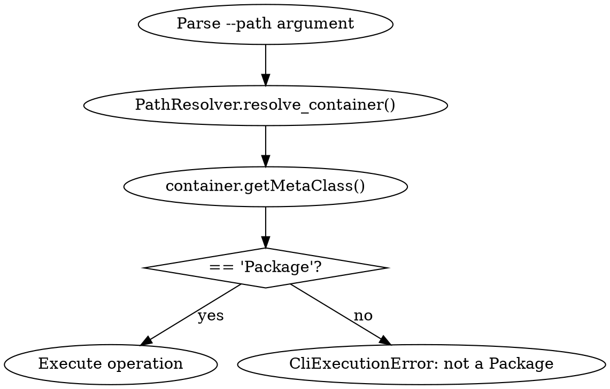
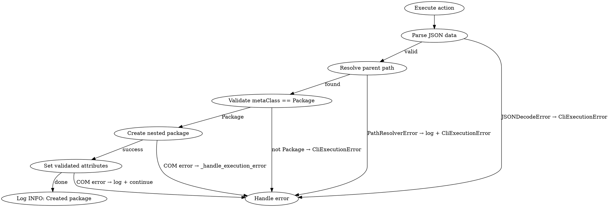

# Package Command Design

**Status:** Approved
**Date:** 2026-07-09
**Author:** Design brainstorming session

## Overview

Add a `package` command group specialized for package operations with bulk creation support, validated attributes, multi-level path navigation, and package-only path validation.

## Requirements

### Core Requirements

1. **Package-specific command** - Separate from generic `element` command
2. **Multi-level path support** - Navigate package hierarchies with `/` or `\` separators
3. **Package-only validation** - Path must resolve to Package element before operations
4. **Bulk creation** - Support single hash or array of hashes to create multiple packages
5. **Validated attributes** - Whitelist of supported attributes, skip unknown with warning
6. **Proper logging** - INFO for success, WARNING for skipped attributes, ERROR for failures
7. **Error handling** - Follow existing patterns with CliExecutionError and proper logging

## Architecture

### Command Structure

```
package (command group)
├─ create  - Create one or multiple packages with attributes
├─ delete  - Delete a package
├─ view    - View package details
└─ items   - List all children items in a package
```

### Files to Create

1. **src/rhapsody_cli/commands/package_command.py**
   - `PackageCommand` class - dispatcher for package subcommands
   - Follows `ElementCommand` pattern
   - Registers 4 actions: PackageCreateAction, PackageDeleteAction, PackageViewAction, PackageListAction

2. **src/rhapsody_cli/actions/package_action.py**
   - `AbstractPackageAction` - Base class with common functionality (path validation, logging, error handling)
   - `PackageCreateAction` - handles `package create` (extends AbstractPackageAction)
   - `PackageDeleteAction` - handles `package delete` (extends AbstractPackageAction)
   - `PackageViewAction` - handles `package view` (extends AbstractPackageAction)
   - `PackageListAction` - handles `package list` (extends AbstractPackageAction)

3. **Register in src/rhapsody_cli/cli/main.py**
   - Add `package` command to CLI dispatcher

### Integration Points

- **PathResolver** - Multi-level path navigation (already exists)
- **OutputFormatter** - Table/JSON/CSV output formatting (already exists)
- **ElementManagementAction** - Base class with logging and error handling (already exists)
- **RPPackage wrapper** - addNestedPackage(), getNestedPackages(), etc. (already exists)

### AbstractPackageAction Base Class

**Purpose:** Common functionality for all package actions to reduce code duplication.

**Common functionality:**
- Package path validation (resolve + check metaClass == "Package")
- Error handling for path resolution failures
- Logging integration for path validation errors

**Implementation:**
```python
class AbstractPackageAction(ElementManagementAction):
    """Base class for package actions with common path validation."""

    def _resolve_and_validate_package(self, path: str) -> Any:
        """Resolve path and validate it's a Package element.

        Args:
            path: Package path to resolve

        Returns:
            RPPackage wrapper if validation succeeds

        Raises:
            CliExecutionError: If path not found or not a Package
        """
        try:
            project = self._get_active_project()
            root = project.getRoot()
            element = PathResolver.resolve_container(root, path)

            # VALIDATE: Must be Package
            meta_class = element.getMetaClass()
            if meta_class != "Package":
                raise CliExecutionError(
                    f"Path '{path}' does not resolve to a Package (found {meta_class})"
                )

            return element

        except PathResolverError as e:
            self.logger.error("Path resolution failed: %s", e)
            raise CliExecutionError(str(e)) from e
        except Exception as e:
            self._handle_execution_error(e, f"Failed to resolve path '{path}'")

    def add_path_argument(self, parser: argparse.ArgumentParser) -> None:
        """Add standard --path argument for package actions."""
        parser.add_argument("--path", required=True, help="Package path")
```

**Usage in actions:**
```python
class PackageCreateAction(AbstractPackageAction):
    def execute(self, args):
        # Resolve and validate parent package
        container = self._resolve_and_validate_package(args.path)

        # Now create packages under validated container
        ...

class PackageDeleteAction(AbstractPackageAction):
    def execute(self, args):
        # Resolve and validate package to delete
        package = self._resolve_and_validate_package(args.path)

        # Delete package
        package.deleteFromProject()
        ...
```

**Benefits:**
- Single point for path validation logic
- Consistent error messages across all actions
- Reduced code duplication
- Easier maintenance and testing

## Subcommands

### 1. package create

**Purpose:** Create one or multiple packages with validated attributes.

**Arguments:**
- `--path <parent-path>` - Parent package path (required, must be Package)
- `--input <json-file>` - JSON file with package attributes (optional, can also use inline JSON)
- `attributes` - JSON data: inline JSON string OR path to external JSON file (required if --input not specified)

**Detection logic:**
- If `--input` specified: read from file
- If positional argument starts with `{` or `[`: treated as inline JSON
- If positional argument is a file path (exists on disk): read and parse as JSON
- Otherwise: raise error

**Examples:**
```bash
# Inline JSON - single package
rhapsody-cli package create --path Sensors '{"name":"TempSensors","description":"Temperature sensors"}'

# Inline JSON - multiple packages (bulk)
rhapsody-cli package create --path Sensors '[{"name":"TempSensors","description":"Temperature"},{"name":"PressureSensors","description":"Pressure"}]'

# External JSON file (positional)
rhapsody-cli package create --path Sensors packages.json

# External JSON file (--input flag)
rhapsody-cli package create --path Sensors --input packages.json

# Reuse exported package JSON
rhapsody-cli package view --path Sensors/TempSensors --format json --output package.json
rhapsody-cli package create --path NewSensors package.json
```

**External JSON file format:**
```json
[
  {
    "name": "TempSensors",
    "description": "Temperature sensors package",
    "properties": {
      "visibility": "public"
    }
  },
  {
    "name": "PressureSensors",
    "description": "Pressure sensors package"
  }
]
```

**Output:** INFO logs to stderr showing created packages. No structured output format.

**Implementation:**
```python
class PackageCreateAction(AbstractPackageAction):
    VALID_ATTRIBUTES = {
        "name", "description", "description_html", "description_rtf",
        "display_name", "display_name_rtf", "properties",
        "stereotypes", "tags"
    }

    def init_arguments(self, sub_parser):
        parser = sub_parser.add_parser("create", help="Create a package")
        parser.add_argument("--path", required=True, help="Parent package path")
        parser.add_argument("--input", help="JSON file with package attributes")
        parser.add_argument("attributes", nargs="?", help="Inline JSON or JSON file path (if --input not specified)")
        self.add_verbose_argument(parser)

    def execute(self, args):
        # Load JSON data (from --input flag or positional argument)
        if args.input:
            data = self._load_json_data(args.input)
        elif args.attributes:
            data = self._load_json_data(args.attributes)
        else:
            raise CliExecutionError("Either --input or attributes argument must be provided")

        packages_data = data if isinstance(data, list) else [data]

        # Resolve and validate parent package (using base class method)
        container = self._resolve_and_validate_package(args.path)

        # Create packages
        created = []
        errors = []
        for pkg_attrs in packages_data:
            try:
                name = pkg_attrs.get("name")
                if not name:
                    raise CliExecutionError("'name' is required in attributes")

                # Filter unknown attributes
                unknown = set(pkg_attrs.keys()) - self.VALID_ATTRIBUTES
                if unknown:
                    self.logger.warning("Skipping unknown attributes: %s", unknown)

                # Create package
                package = container.addNestedPackage(name)

                # Set validated attributes
                self._set_attributes(package, pkg_attrs)

                full_path = f"{args.path}/{name}"
                self.logger.info("Created package: %s", full_path)
                created.append(name)

            except Exception as e:
                self.logger.error("Failed to create package '%s': %s", pkg_attrs.get("name", "unknown"), e)
                errors.append((pkg_attrs.get("name", "unknown"), str(e)))

        # Report results
        if errors and not created:
            raise CliExecutionError(f"Created 0/{len(packages_data)} packages; all failed")
        elif errors:
            self.logger.info("Created %d/%d packages with %d error(s)", len(created), len(packages_data), len(errors))

    def _load_json_data(self, attributes_input: str) -> Any:
        """Load JSON data from inline string or external file.

        Args:
            attributes_input: Inline JSON string or file path

        Returns:
            Parsed JSON data (hash or array)

        Raises:
            CliExecutionError: If JSON invalid or file not found
        """
        # Check if inline JSON (starts with { or [)
        if attributes_input.startswith("{") or attributes_input.startswith("["):
            try:
                return json.loads(attributes_input)
            except json.JSONDecodeError as e:
                raise CliExecutionError(f"Invalid inline JSON: {e}")

        # Otherwise treat as file path
        import os
        if not os.path.exists(attributes_input):
            raise CliExecutionError(f"File not found: {attributes_input}")

        try:
            with open(attributes_input, "r", encoding="utf-8") as f:
                return json.load(f)
        except json.JSONDecodeError as e:
            raise CliExecutionError(f"Invalid JSON in file '{attributes_input}': {e}")
        except OSError as e:
            raise CliExecutionError(f"Failed to read file '{attributes_input}': {e}")
```

### 2. package delete

**Purpose:** Delete a package at specified path.

**Arguments:**
- `--path <package-path>` - Package path to delete (required, must be Package)

**Example:**
```bash
rhapsody-cli package delete --path Sensors/OldPackage
```

**Implementation:**
```python
class PackageDeleteAction(AbstractPackageAction):
    def init_arguments(self, sub_parser):
        parser = sub_parser.add_parser("delete", help="Delete a package")
        parser.add_argument("--path", required=True, help="Package path to delete")
        self.add_verbose_argument(parser)

    def execute(self, args):
        # Resolve and validate package (using base class method)
        package = self._resolve_and_validate_package(args.path)

        # Delete package
        try:
            package.deleteFromProject()
            self.logger.info("Deleted package: %s", args.path)
        except Exception as e:
            self._handle_execution_error(e, f"Failed to delete package '{args.path}'")
```

### 3. package view

**Purpose:** View package details (name, GUID, description, etc.).

**Arguments:**
- `--path <package-path>` - Package path to view (required, must be Package)
- `--format <format>` - Output format: table, json, csv (optional, default: table)
- `--output <output-file>` - Write output to file instead of stdout (optional)

**Example:**
```bash
# Default table output to console
rhapsody-cli package view --path Sensors

# JSON output to file
rhapsody-cli package view --path Sensors --format json --output package.json

# CSV output to file
rhapsody-cli package view --path Sensors/TemperatureSensors --format csv --output package.csv
```

**Output formats:**
- **Default**: Table format (human-readable)
- **JSON**: Via `--format json` (machine-parsable)
- **CSV**: Via `--format csv` (spreadsheet-friendly)

**Output examples:**

**Table format:**
```
+-----------+--------------------------------------+
| Key       | Value                                |
+-----------+--------------------------------------+
| Name      | TempSensors                          |
| GUID      | {12345678-1234-1234-1234-1234567890} |
| Desc      | Temperature sensors package          |
| MetaClass | Package                              |
| FullPath  | Sensors/TempSensors                  |
+-----------+--------------------------------------+
```

**JSON format:**
```json
{
  "name": "TempSensors",
  "guid": "{12345678-1234-1234-1234-1234567890}",
  "description": "Temperature sensors package",
  "metaClass": "Package",
  "fullPath": "Sensors/TempSensors"
}
```

**CSV format:**
```csv
Name,GUID,Description,MetaClass,FullPath
TempSensors,{12345678-1234-1234-1234-1234567890},Temperature sensors package,Package,Sensors/TempSensors
```

**Workflow: View → Create**
The JSON output from `view` can be used as input for `create`:
```bash
# Export package to JSON file
rhapsody-cli package view --path Sensors/TempSensors --format json --output package.json

# Edit package.json (modify name, description, etc.)

# Create new package from exported JSON
rhapsody-cli package create --path Sensors package.json
```

The create command ignores extra fields from view output (guid, metaClass, fullPath) and only uses validated attributes (name, description, properties, stereotypes, tags).

**Output behavior:**
- Default: Output to stdout (console)
- With `--output`: Write to specified file (creates/overwrites)
- All output goes to stdout or file (not logger) for safe use in scripts

**Implementation:**
```python
class PackageViewAction(AbstractPackageAction):
    def init_arguments(self, sub_parser):
        parser = sub_parser.add_parser("view", help="View package details")
        parser.add_argument("--path", required=True, help="Package path to view")
        parser.add_argument("--format", choices=["table", "json", "csv"], default="table", help="Output format")
        parser.add_argument("--output", help="Write output to file instead of stdout")
        self.add_verbose_argument(parser)

    def execute(self, args):
        # Resolve and validate package (using base class method)
        package = self._resolve_and_validate_package(args.path)

        # Get package details
        try:
            name = package.getName()
            guid = package.getGUID()
            description = package.getDescription()
            meta_class = package.getMetaClass()
            full_path = package.getFullPathName()

            # Prepare data for output
            data = {
                "name": name,
                "guid": guid,
                "description": description,
                "metaClass": meta_class,
                "fullPath": full_path,
            }

            table_rows = [
                ["Name", name],
                ["GUID", guid],
                ["Description", description],
                ["MetaClass", meta_class],
                ["FullPath", full_path],
            ]

            # Format output
            output = self._format_output(data, table_rows, args.format)

            # Write to file or stdout
            if args.output:
                self._write_to_file(args.output, output)
                self.logger.info("Wrote package details to: %s", args.output)
            else:
                print(output)
        except Exception as e:
            self._handle_execution_error(e, f"Failed to view package '{args.path}'")

    def _format_output(self, data, table_rows, format_type):
        """Format output based on format parameter."""
        if format_type == "json":
            return OutputFormatter.json_format(data)
        elif format_type == "csv":
            # CSV: header row + data row
            headers = ["Name", "GUID", "Description", "MetaClass", "FullPath"]
            data_row = [data["name"], data["guid"], data["description"], data["metaClass"], data["fullPath"]]
            return OutputFormatter.csv_format(headers, [data_row])
        else:
            return OutputFormatter.table(["Property", "Value"], table_rows)

    def _write_to_file(self, file_path, content):
        """Write content to file."""
        try:
            with open(file_path, "w", encoding="utf-8") as f:
                f.write(content)
        except OSError as e:
            raise CliExecutionError(f"Failed to write file '{file_path}': {e}")
```

### 4. package list

**Purpose:** List all nested packages (children packages) in a package.

**Arguments:**
- `--path <package-path>` - Package path (required, must be Package)
- `--format <format>` - Output format: table, json, csv (optional, default: table)
- `--output <output-file>` - Write output to file instead of stdout (optional)

**Example:**
```bash
# Default table output to console
rhapsody-cli package list --path Sensors

# JSON output to file
rhapsody-cli package list --path Sensors --format json --output packages.json

# CSV output to file
rhapsody-cli package list --path Sensors --format csv --output packages.csv
```

**Output formats:**
- **Default**: Table format (Name column)
- **JSON**: Via `--format json` - Array of package names
- **CSV**: Via `--format csv` - Name column

**Output examples:**

**Table format:**
```
+----------------+
| Name           |
+----------------+
| TempSensors    |
| PressureSensors|
| FlowSensors    |
+----------------+
```

**JSON format:**
```json
["TempSensors", "PressureSensors", "FlowSensors"]
```

**CSV format:**
```csv
Name
TempSensors
PressureSensors
FlowSensors
```

**Output behavior:**
- Default: Output to stdout (console)
- With `--output`: Write to specified file (creates/overwrites)
- All output goes to stdout or file (not logger) for safe use in scripts

**Implementation:**
```python
class PackageListAction(AbstractPackageAction):
    def init_arguments(self, sub_parser):
        parser = sub_parser.add_parser("list", help="List nested packages")
        parser.add_argument("--path", required=True, help="Package path")
        parser.add_argument("--format", choices=["table", "json", "csv"], default="table", help="Output format")
        parser.add_argument("--output", help="Write output to file instead of stdout")
        self.add_verbose_argument(parser)

    def execute(self, args):
        # Resolve and validate package (using base class method)
        package = self._resolve_and_validate_package(args.path)

        # Get nested packages
        try:
            nested_packages = package.getNestedPackages()
            package_names = [pkg.getName() for pkg in nested_packages]

            # Prepare table rows for output
            table_rows = [[name] for name in package_names]

            # Format output
            output = self._format_output(package_names, table_rows, args.format)

            # Write to file or stdout
            if args.output:
                self._write_to_file(args.output, output)
                self.logger.info("Wrote %d packages to: %s", len(package_names), args.output)
            else:
                print(output)
        except Exception as e:
            self._handle_execution_error(e, f"Failed to list packages in '{args.path}'")

    def _format_output(self, package_names, table_rows, format_type):
        """Format output based on format parameter."""
        if format_type == "json":
            return OutputFormatter.json_format(package_names)
        elif format_type == "csv":
            return OutputFormatter.csv_format(["Name"], table_rows)
        else:
            return OutputFormatter.table(["Name"], table_rows)

    def _write_to_file(self, file_path, content):
        """Write content to file."""
        try:
            with open(file_path, "w", encoding="utf-8") as f:
                f.write(content)
        except OSError as e:
            raise CliExecutionError(f"Failed to write file '{file_path}': {e}")
```

## Validated Attribute Whitelist

**Supported attributes for package creation:**

| Attribute | Method | Description |
|-----------|--------|-------------|
| `name` | `setName()` | Required - package name |
| `description` | `setDescription()` | Plain text description |
| `description_html` | `setDescriptionHTML()` | HTML description |
| `description_rtf` | `setDescriptionRTF()` | RTF description |
| `display_name` | `setDisplayName()` | Display name |
| `display_name_rtf` | `setDisplayNameRTF()` | RTF display name |
| `properties` | `setPropertyValue()` | Dict of custom properties |
| `stereotypes` | `addStereotype()` | Array of stereotype names to apply |
| `tags` | `setTagValue()` | Dict of tag name to value |

**Whitelist constant:**
```python
VALID_ATTRIBUTES = {
    "name", "description", "description_html", "description_rtf",
    "display_name", "display_name_rtf", "properties",
    "stereotypes", "tags"
}
```

**Example JSON with stereotypes and tags:**
```json
{
  "name": "MyPackage",
  "description": "Main package",
  "stereotypes": ["auto_generated", "version_1_0"],
  "tags": {
    "status": "active",
    "version": "1.0.0"
  }
}
```

**Validation behavior:**
- Required: `name` attribute (validated first)
- Optional: All other whitelist attributes
- Unknown attributes: Logged as warning, silently skipped
- Type validation: JSON must be hash or array

**Attribute setter implementation:**
```python
def _set_attributes(self, package, attrs):
    """Set validated attributes on package using helper methods."""
    self._set_basic_attributes(package, attrs)
    self._set_properties(package, attrs)
    self._set_stereotypes(package, attrs)
    self._set_tags(package, attrs)

def _set_basic_attributes(self, package, attrs):
    """Set basic string attributes (description, display_name, etc.)."""
    if "description" in attrs:
        package.setDescription(attrs["description"])
    if "description_html" in attrs:
        package.setDescriptionHTML(attrs["description_html"])
    if "description_rtf" in attrs:
        package.setDescriptionRTF(attrs["description_rtf"])
    if "display_name" in attrs:
        package.setDisplayName(attrs["display_name"])
    if "display_name_rtf" in attrs:
        package.setDisplayNameRTF(attrs["display_name_rtf"])

def _set_properties(self, package, attrs):
    """Set custom properties."""
    if "properties" not in attrs:
        return
    for key, val in attrs["properties"].items():
        package.setPropertyValue(key, val)

def _set_stereotypes(self, package, attrs):
    """Apply stereotypes to package."""
    if "stereotypes" not in attrs:
        return
    for stereotype_name in attrs["stereotypes"]:
        try:
            package.addStereotype(stereotype_name, "Package")
        except Exception as e:
            self.logger.warning("Failed to add stereotype '%s': %s", stereotype_name, e)

def _set_tags(self, package, attrs):
    """Set tags on package."""
    if "tags" not in attrs:
        return
    for tag_name, tag_value in attrs["tags"].items():
        try:
            package.setPropertyValue(tag_name, str(tag_value))
        except Exception as e:
            self.logger.warning("Failed to set tag '%s': %s", tag_name, e)
```

**Benefits:**
- Each method does one thing (single responsibility)
- Easier to test each attribute type independently
- Cleaner, more readable code
- Better separation of concerns
- Follows Python best practices for function length

## Path Validation

### Multi-level Path Support

- Path separator: `/` or `\` (handled by existing `PathResolver`)
- Examples: `Sensors`, `Sensors/TemperatureSensors`, `Main/Subsystem/Components`
- Implementation: Use `PathResolver.resolve_container(root, path)` from existing infrastructure

### Package-only Validation

**Validation flow:**


**Validation code:**
```python
container = PathResolver.resolve_container(root, args.path)
meta_class = container.getMetaClass()
if meta_class != "Package":
    raise CliExecutionError(
        f"Path '{args.path}' does not resolve to a Package (found {meta_class})"
    )
```

### Error Messages

- **Invalid path**: `"Path 'Sensors/Invalid' not found"` (from PathResolverError)
- **Not a Package**: `"Path 'Sensors/MyClass' does not resolve to a Package (found Class)"`
- **Missing name**: `"'name' is required in attributes"`
- **Unknown attributes**: `"Skipping unknown attributes: invalid_attr, another_unknown"` (warning log)

## Logging and Error Handling

### Logger Integration

Follow existing `ElementManagementAction` patterns:

- Use `self.logger` (inherited from base class)
- Log levels: INFO for success, WARNING for skipped attributes, ERROR for failures
- Format: `self.logger.info("Created package: %s/%s", args.path, name)`

### Error Handling Patterns

**From existing actions:**

1. **CliExecutionError** - Validation failures and user errors
2. **_handle_execution_error(e, message)** - COM operation failures
3. **_handle_connection_error(e, message)** - Rhapsody connection errors
4. **PathResolverError** - Path resolution failures

**Implementation:**
```python
try:
    # Operation
except PathResolverError as e:
    self.logger.error("Path resolution failed: %s", e)
    raise CliExecutionError(str(e)) from e
except Exception as e:
    self._handle_execution_error(e, "Failed to ...")
```

### Error Handling Flow



## Testing

### Unit Tests

**File:** `tests/unit/actions/test_package_action.py`

**Test coverage:**
- Mocked COM objects (no Rhapsody installation required)
- Each subcommand tested independently
- Path validation tests (valid Package, invalid element type)
- Attribute validation tests (valid attributes, unknown attributes skipped)
- Bulk creation tests (single hash, array of hashes)
- Error handling tests (invalid JSON, path not found, not Package)

**Test structure:**
```python
class TestPackageCreateAction:
    def test_create_single_package_inline_json(self, mock_project):
        # Test single package creation with inline JSON

    def test_create_bulk_packages_inline_json(self, mock_project):
        # Test array of packages with inline JSON

    def test_create_single_package_from_file(self, mock_project, tmp_path):
        # Test single package creation from external JSON file

    def test_create_bulk_packages_from_file(self, mock_project, tmp_path):
        # Test array of packages from external JSON file

    def test_create_with_attributes(self, mock_project):
        # Test attribute setting (description, properties)

    def test_create_with_stereotypes(self, mock_project):
        # Test stereotype application

    def test_create_with_tags(self, mock_project):
        # Test tag setting

    def test_create_unknown_attributes_skipped(self, mock_project):
        # Test warning log for unknown attributes

    def test_create_path_not_package(self, mock_project):
        # Test error when path resolves to Class

    def test_create_missing_name(self, mock_project):
        # Test error when name not in attributes

    def test_create_invalid_inline_json(self, mock_project):
        # Test inline JSON parse error

    def test_create_file_not_found(self, mock_project):
        # Test error when external file not found

    def test_create_invalid_json_in_file(self, mock_project, tmp_path):
        # Test JSON parse error in external file

class TestPackageDeleteAction:
    def test_delete_package(self, mock_project):
        # Test deletion

    def test_delete_path_not_package(self, mock_project):
        # Test error when not Package

class TestPackageViewAction:
    def test_view_package(self, mock_project):
        # Test viewing details

    def test_view_output_formats(self, mock_project):
        # Test table/JSON/CSV output

class TestPackageListAction:
    def test_list_items(self, mock_project):
        # Test listing children

    def test_list_empty_package(self, mock_project):
        # Test empty package
```

### Integration Tests

**File:** `tests/integration/test_package_command.py`

**Test coverage:**
- Real Rhapsody COM automation (requires running Rhapsody)
- Multi-level path navigation
- Package creation with real attributes
- Package deletion and cleanup

## Implementation Checklist

### Phase 1: Core Infrastructure
- [ ] Create `package_command.py` with PackageCommand dispatcher
- [ ] Create `package_action.py` with AbstractPackageAction base class
- [ ] Implement `AbstractPackageAction._resolve_and_validate_package()` method
- [ ] Register `package` command in `main.py`

### Phase 2: Implementation
- [ ] Implement PackageCreateAction (extends AbstractPackageAction) with bulk support and validation
- [ ] Implement PackageDeleteAction (extends AbstractPackageAction) using base class validation
- [ ] Implement PackageViewAction (extends AbstractPackageAction) with output formatting
- [ ] Implement PackageListAction (extends AbstractPackageAction) with nested package listing

### Phase 3: Testing
- [ ] Write unit tests for all 4 actions
- [ ] Test path validation (Package vs non-Package)
- [ ] Test attribute validation (whitelist vs unknown)
- [ ] Test bulk creation (single vs array)
- [ ] Test error handling

### Phase 4: Integration
- [ ] Integration tests with real Rhapsody
- [ ] Manual CLI testing
- [ ] Update README.md with package command usage

## Success Criteria

1. **All subcommands working** - create, delete, view, items
2. **Multi-level path navigation** - works with `/` and `\` separators
3. **Package-only validation** - errors if path not Package
4. **Bulk creation** - single hash and array supported
5. **Validated attributes** - unknown attributes skipped with warning
6. **Proper logging** - INFO, WARNING, ERROR levels used correctly
7. **Error handling** - CliExecutionError for validation, proper handling for COM errors
8. **Test coverage** - All actions tested with mocked COM
9. **Documentation** - README updated with package command examples

## Risks and Mitigations

### Risk 1: Path validation overhead
**Risk:** Additional validation adds complexity
**Mitigation:** Follow existing pattern, simple metaClass check

### Risk 2: Attribute validation maintenance
**Risk:** New Rhapsody attributes require whitelist updates
**Mitigation:** Document whitelist clearly, easy to extend

### Risk 3: Bulk creation error handling
**Risk:** Partial failures in bulk creation
**Mitigation:** Report created/failed counts, continue on errors

## Dependencies

- **Existing infrastructure:** PathResolver, OutputFormatter, ElementManagementAction
- **RPPackage wrapper:** Already complete with all methods
- **Test infrastructure:** Mocked COM objects in `tests/fakes.py`

## Timeline

- **Phase 1 (Core):** 1 hour
- **Phase 2 (Implementation):** 2 hours
- **Phase 3 (Testing):** 1 hour
- **Phase 4 (Integration):** 0.5 hour
- **Total:** ~4.5 hours

## Related Documents

- [Element CLI Enhancements Design](2026-07-09-element-cli-enhancements-design.md) - Existing element command patterns
- [Rhapsody COM API Design](2026-07-06-rhapsody-cli-com-api-design.md) - RPPackage wrapper implementation
- [Project README](../README.md) - User documentation